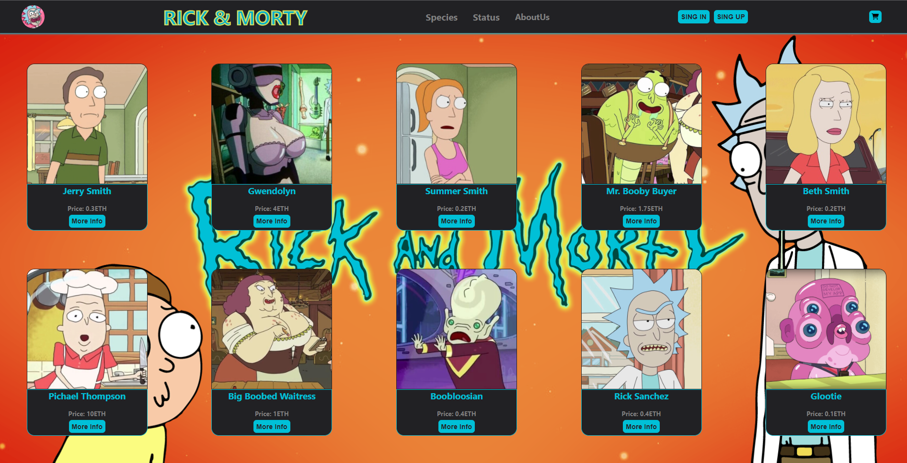

# Proyecto App Web con ReactJS

El siguiente proyecto sirve como ejemplo de desarrollo de una App web con ReactJS y utilizando Firebase como base de datos. Se construyó un e-commerce de personajes de la serie: "Rick & Morty" que cuenta con las siguientes características:

* Los productos están presentes en el *Home* de la App o pueden filtrarse por categorías (especies o estado, en este caso) desde el *NavBar*.
* El manejo de productos dentro de la App permite la funcion de *agregar al carrito*, seleccionando previamente la cantidad deseada a agregar dentro del stock disponible.
* Carrito interactivo: el usuario puede agregar varias unidades de un mismo producto al mismo tiempo y no perder la cuenta gracias a la incorporación de un contador en el *cart widget*. Ademas, el usuario puede dentro del carrito (llegado al caso) modificar la cantidad de cada producto elegido inicialmente, como tambien, vaciar el carrito. 
* También se implementó el uso de localStorage para que el carrito sea persistente y no se pierdan los productos por algún refresh no deseado de la página.
* Para la navegación de las diferentes views de la App se utilizó *react-dom-router*.
* Como ya fue mencionado, se utilizó *Firebase* como base de datos para alojar los diferentes productos. Tambien se utilizaron las funcionalidades de *Firebase Auth* para el manejo de usuarios dentro de la App, es posible:
    * Registrarse con email, iniciar sesión y cerrar sesión cuando el usuario lo desee.
    * Ver informacion de la cuenta creada: nombre, email, fecha de creacion.
    * Recuperacion de contraseña via email en la seccion *Sign In*.
    * Eliminar cuenta.

### Librerías extra

Se implementaron algunas herramientas extra al proyecto para solucionar, principalmente, temas de diseño y experiencia de usuario:

#### Font Awesome
Para el manejo de los iconos como: CartWidget, Log Out, Eliminar producto.
(https://fontawesome.com/docs/web/use-with/react/)

#### React Spinners
Herramienta utilizada para implementar spinners de carga dentro de la App. Mejoran la experiencia de usuario al dar una señal de carga.
(https://www.npmjs.com/package/react-spinners)

#### React Toastify
Sitema de notificaciones emergentes para notificar al usuario de determinado error y/o confirmacion.
(https://www.npmjs.com/package/react-toastify)

#### App demo
